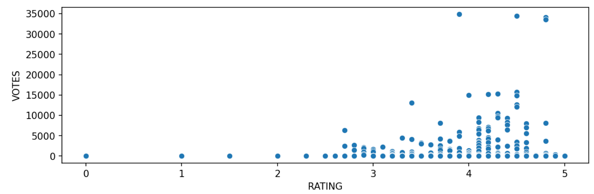
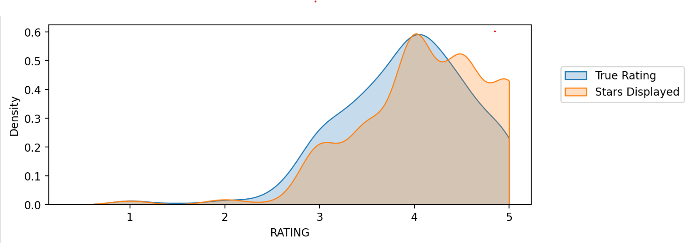

# Fandango Movie Ratings Analysis

## Project Overview
This capstone project investigates whether Fandango's online movie ratings in 2015 exhibited a bias towards inflating scores to boost ticket sales. The analysis is based on the investigative article: ["Be Suspicious Of Online Movie Ratings, Especially Fandango’s"](http://fivethirtyeight.com/features/fandango-movies-ratings/) by FiveThirtyEight.

## GOAL 
The objective was to use data analysis and visualization techniques to determine if Fandango’s displayed ratings were artificially higher than the "true" user ratings and other aggregate scores from sites like Metacritic, IMDb, and Rotten Tomatoes.

## Key Findings
* **Fandango Bias:** My analysis confirmed the discrepancy noted by FiveThirtyEight; Fandango often displayed rounded-up star ratings compared to the actual average user rating.
* **Correlation:** There is a high correlation between the `STARS` (displayed) and `RATING` (actual), but visual analysis revealed specific clusters of films where the displayed score was artificially inflated.
* **Rating Distribution:** The visualization clearly shows the shift in distribution between displayed stars and true ratings, highlighting the lack of low ratings on the platform.

## Key Visualizations
*A brief look at the data insights generated in the project:*

*Figure 1: Relationship between movie rating and number of user votes.*

*Figure 2: Distribution of displayed STARS vs. true RATING scores.*

## Key Technologies Used
* **Language:** Python
* **Libraries:** Pandas (Data manipulation), NumPy, Matplotlib & Seaborn (Data visualization)

## Files Included
* `00-Capstone-Project.ipynb`: The Jupyter Notebook containing the full analysis, data cleaning, and visualization.
* `fandango_scrape.csv`: Dataset containing film data pulled from Fandango.
* `all_sites_scores.csv`: Dataset containing aggregate ratings from multiple review platforms.

## How to View
You can view the `00-Capstone-Project.ipynb` file directly in your browser through GitHub's notebook viewer. Alternatively, you can download the repository and open the notebook in Jupyter or Google Colab.
